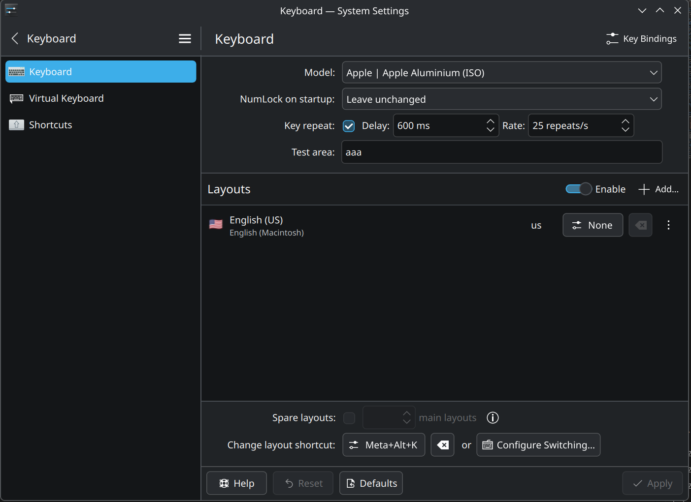

# Asahi-Map

A lightweight Go application for handling macOS Option key shortcuts on Linux. Designed as a minimal alternative to Toshy, focusing solely on Option key special character mappings with minimal memory footprint.

## Features

- 🎹 **macOS-style Option key shortcuts** - Type special characters like on macOS
- 🇫🇷 **AZERTY Mac layout** - Full French keyboard support with Option and Option+Shift mappings
- 🇺🇸 **QWERTY Mac layout** - US keyboard support with all Option key characters
- 🖥️ **System tray integration** - Status icon and layout switching via fyne.io/systray
- ⚡ **Lightweight** - Written in Go for minimal memory usage (~5 MB)
- 🔧 **Configurable** - YAML-based configuration files
- 🔄 **AltGr passthrough** - Works on Wayland, X11, and all applications

## Requirements

- Linux with evdev support (Asahi Linux / Fedora)
- Root access or `input` group membership
- Proper XKB layout with AltGr (3rd level) support (see [Keyboard Setup](#keyboard-setup))

## Installation

### From source

```bash
# Build
go build -ldflags="-s -w" -o asahi-map ./cmd/asahi-map

# Install
sudo ./install.sh
```

### Setup permissions

```bash
# Add your user to the input group
sudo usermod -aG input $USER

# Logout and login again for changes to take effect
```

## Keyboard Setup

Asahi-Map uses **AltGr passthrough** to leverage your system's XKB layout. You need to configure your keyboard layout properly for the special characters to work.

> ⚠️ **Important:** The Asahi-Map layout **must match** your system's XKB layout!
> - System in `fr(mac)` → use `azerty-mac` in Asahi-Map
> - System in `us(mac)` → use `qwerty-mac` in Asahi-Map
>
> Asahi-Map only intercepts Left Alt and converts it to Right Alt (AltGr). The actual character produced depends on your **system's XKB layout**, not Asahi-Map's layout selection.

Adding layout is not needed if the correct one was defined at install.


### AZERTY Mac (FR)

Use the `fr(mac)` layout:

**KDE:** Settings → Keyboard → Layouts → Add → French (Macintosh)

**GNOME:**
```bash
gsettings set org.gnome.desktop.input-sources sources "[('xkb', 'fr+mac')]"
```

**Manual configuration (`~/.config/kxkbrc` for KDE):**
```ini
[Layout]
LayoutList=fr
VariantList=mac
Model=applealu_iso
Use=true
```

### QWERTY Mac (US)

Use the `us(mac)` layout:



**KDE:** Settings → Keyboard → Layouts → Add → English (US) (Macintosh)

**GNOME:**
```bash
gsettings set org.gnome.desktop.input-sources sources "[('xkb', 'us+mac')]"
```

**Manual configuration (`~/.config/kxkbrc` for KDE):**
```ini
[Layout]
LayoutList=us
VariantList=mac
Model=applealu_iso
Use=true
```

## Usage

```bash
# Run with system tray (default)
asahi-map

# Run without system tray (headless mode)
asahi-map -no-tray

# Run with specific layout
asahi-map -layout azerty-mac

# Use custom config file
asahi-map -config /path/to/config.yaml

# Enable debug logging
asahi-map -log-level debug

# Show version
asahi-map -version
```

### Command Line Options

| Flag | Description |
|------|-------------|
| `-config <path>` | Path to a custom config file |
| `-layout <name>` | Force a specific layout (overrides config) |
| `-log-level <level>` | Log level: `debug`, `info`, `warn`, `error` |
| `-no-tray` | Run without system tray icon (headless mode) |
| `-version` | Show version information |

## Configuration

### Config File Locations

Configuration files are searched in this order:

1. Path passed via `-config` flag
2. `~/.config/asahi-map/config.yaml` (user config)
3. `<executable_dir>/configs/config.yaml` (portable mode)
4. `/etc/asahi-map/config.yaml` (system-wide)

### Main Config (`config.yaml`)

```yaml
layout: azerty-mac      # Layout name (without .yaml extension)
log_level: info         # Log level: debug, info, warn, error
keyboard_device: auto   # Keyboard detection (auto recommended)
```

### Layout Files (`layouts/*.yaml`)

Layouts define key mappings for the **Option (Left Alt)** key.

#### Layout Structure

```yaml
name: "AZERTY Mac"
description: "French AZERTY keyboard for Mac - Option key special characters"

# Alt + key mappings
alt:
  "5":
    passthrough: "5"    # Alt+5 → AltGr+5 → {

# Shift + Alt + key mappings  
shift_alt:
  "5":
    passthrough: "5"    # Shift+Alt+5 → Shift+AltGr+5 → [

# Dead keys (combinable accents)
dead_keys:
  acute:
    base: "´"
    combinations:
      "e": "é"
      "a": "á"
```

## Mapping Types

### 1. Passthrough (Recommended)

Converts `Left Alt + key` to `Right Alt (AltGr) + key`, using your system's native AltGr mappings.

```yaml
"5":
  passthrough: "5"  # Alt+5 → AltGr+5 → {
```

**When to use:** For all characters already defined in your system layout via AltGr. This is the most reliable and universal method - works everywhere (Wayland, X11, Firefox, terminals, etc.).

### 2. Direct Unicode Character (`char`)

Outputs a specific Unicode character directly.

```yaml
"c":
  char: "©"  # Outputs copyright symbol
```

**When to use:** For special characters not available via AltGr (mathematical symbols, emojis, rare characters).

**Limitation:** Uses `Ctrl+Shift+U` method (works in GTK/Qt apps but not everywhere).

### 3. Unicode Codepoint (`codepoint`)

Same as `char` but using hexadecimal notation.

```yaml
"p":
  codepoint: 0x03C0  # π (Greek pi)
```

**When to use:** Equivalent to `char`, useful for characters hard to type in YAML.

### 4. Dead Keys (`dead_key`)

Combinable accents like on macOS.

```yaml
alt:
  "e":
    dead_key: true
    dead_key_id: "acute"
    char: "´"

dead_keys:
  acute:
    base: "´"
    combinations:
      "e": "é"
      "a": "á"
      "o": "ó"
```

**When to use:** For macOS-style combinable accents. `Option+e` then `e` → `é`, `Option+e` then `space` → `´`.

## Supported Key Names

| Name | Physical Key (AZERTY) |
|------|----------------------|
| `1` to `0` | Number row |
| `q`, `w`, `e`, `r`, `t`, `y`, `u`, `i`, `o`, `p` | Top row |
| `a`, `s`, `d`, `f`, `g`, `h`, `j`, `k`, `l` | Home row |
| `z`, `x`, `c`, `v`, `b`, `n`, `m` | Bottom row |
| `grave` | @ key (below Escape) |
| `minus`, `equal` | ) and - keys |
| `leftbrace`, `rightbrace` | ^ and $ keys |
| `semicolon`, `apostrophe` | M and ù keys |
| `comma`, `dot`, `slash` | ; : ! keys |
| `102nd` | < key (left of W) |
| `space` | Spacebar |

## Quick Reference: When to Use What?

| Situation | Method |
|-----------|--------|
| Standard AZERTY characters (é, è, ç, €, {, }, etc.) | `passthrough` |
| Universal special characters | `passthrough` to AltGr |
| Rare symbols (∞, ™, ©, π, etc.) | `char` or `codepoint` |
| Combinable accents (á, ñ, ü) | `dead_keys` |
| Maximum compatibility | **Always `passthrough`** |

## System Tray

The system tray icon allows you to:

- **Enable/Disable** key remapping in real-time
- **Switch layouts** among those available in `layouts/`
- **Quit** the application

The selected layout is automatically saved to `config.yaml`.

## License

MIT License

## Credits

Inspired by [Toshy](https://github.com/RedBearAK/toshy) but reimplemented in Go for efficiency.

Made with {[❤️]} for Asahi users!
